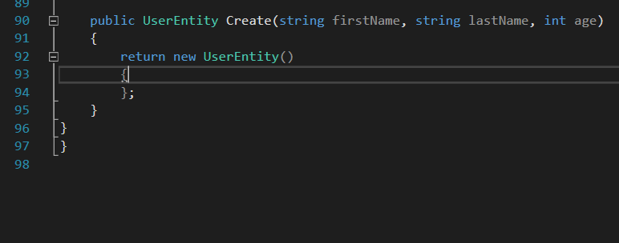

# Mapping Generator

|Branch   | Status  |
|---------|---------|
|Master   | [](https://ci.appveyor.com/project/cezarypiatek/mappinggenerator/branch/master)|
|Develop  | [](https://ci.appveyor.com/project/cezarypiatek/mappinggenerator/branch/develop)|


"AutoMapper" like, Roslyn based, code fix provider that allows to generate mapping code in design time.

You can download it as Visual Studio Extension from [Visual Studio Marketplace](https://marketplace.visualstudio.com/items?itemName=54748ff9-45fc-43c2-8ec5-cf7912bc3b84.mappinggenerator).

## Further Development
If you find this extension useful (you feel it helps you on the daily basis) you can support further development by bying me a coffee (it's simple, just click the button below)

[](https://www.buymeacoffee.com/tmAJLYvWy)

### Contributing
Before you start any contributig work, plase read the [contribution guidline](/docs/CONTRIBUTING.md)

## Main features

### Generate mapping method body

#### Pure mapping method
Non-void method that takes single parameter

```csharp
public UserDTO Map(UserEntity entity)
{
    
}
```


#### Updating method
Void method that takes two parameters
```csharp
public void Update(UserDTO source, UserEntity target)
{
    
}
```


#### Mapping Constructor
Constructor method that takes single complex parameter

```csharp
public UserDTO(UserEntity user)
{
    
}
```


Constructor method that takes more than one parameter

```csharp
public UserDTO(string firstName, string lastName, int age, int cash)
{
}
```


#### Updating member method
Void member method that takes single parameter
```csharp
public void UpdateWith(UserEntity en)
{
    
}
```


Void member method with more than one parameter
```csharp
public void Update(string firstName, string lastName, int age)
{
}
```


### Generate inline code for fixing Compiler Errors: 
[CS0029](https://docs.microsoft.com/en-us/dotnet/csharp/language-reference/compiler-messages/cs0029) Cannot implicitly convert type 'type' to 'type'


[CS0266](https://docs.microsoft.com/en-us/dotnet/csharp/language-reference/compiler-messages/cs0266) Cannot implicitly convert type 'type1' to 'type2'. An explicit conversion exists (are you missing a cast?)


CS7036 There is no argument given that corresponds to the required formal parameter 


## Other mappings

- Complete empty initialization block


- Provide local accessoble variables as parameters for method and constructor invocation


## Mapping rules
- Mapping Property-To-Property
  ```csharp
  target.FirstName = source.FirstName;
  target.LastName = source.LastName;
  ```
- Mapping Method Call-To-Property
  ```csharp
  target.Total = source.GetTotal()
  ```
- Flattening with sub-property
  ```csharp
  target.UnitId = source.Unit.Id
  ```
- Mapping complex property
  ```csharp
  var targetMainAddress = new AddressDTO();
  targetMainAddress.BuildingNo = source.MainAddress.BuildingNo;
  targetMainAddress.City = source.MainAddress.City;
  targetMainAddress.FlatNo = source.MainAddress.FlatNo;
  targetMainAddress.Street = source.MainAddress.Street;
  targetMainAddress.ZipCode = source.MainAddress.ZipCode;
  target.MainAddress = targetMainAddress;
  ```
- Mapping collections
  ```csharp
  target.Addresses = source.Addresses.Select(addressEntity =>
  {
      var addressDTO = new AddressDTO();
      addressDTO.BuildingNo = addressEntity.BuildingNo;
      addressDTO.City = addressEntity.City;
      addressDTO.FlatNo = addressEntity.FlatNo;
      addressDTO.Street = addressEntity.Street;
      addressDTO.ZipCode = addressEntity.ZipCode;
      return addressDTO;
  }).ToList().AsReadOnly();
  ```
- Unwrapping wrappers 
  ```csharp
  customerEntity.Kind = cutomerDTO.Kind.Selected;
  ```
  
  ```csharp
    public enum CustomerKind
    {
        Regular,
        Premium
    }

    public class Dropdown<T>
    {
        public List<T> AllOptions { get; set; }

        public T Selected { get; set; }
    }

    public class CustomerDTO
    {
        public string Name { get; set; }
        public Dropdown<CustomerKind> Kind { get; set; }
    }

    public class UserEntity
    {
        public string Name { get; set; }
        public CustomerKind Kind { get; set; }
    }
  ```
- Using existing direct mapping constructor
  ```csharp
  target.MainAddress = new AddressDTO(source.MainAddress);
  ```

- using existing multi-parameter constuctor
  ```csharp
  this.User =  new UserDTO(firstName: entity.FirstName, lastName: entity.LastName, age: entity.Age);
  ```

